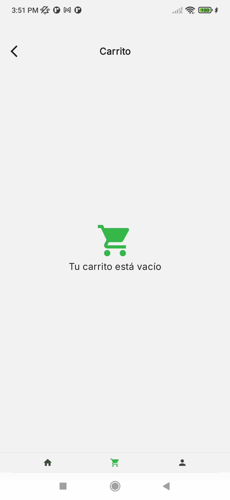

# MuniApp

Aplicación móvil para Android desarrollada en Kotlin, utilizando Jetpack Compose para la interfaz de usuario, Hilt para inyección de dependencias, Room para persistencia local y Retrofit para consumo de APIs.

## Características

- Interfaz moderna con Jetpack Compose
- Navegación con Navigation Compose
- Inyección de dependencias con Hilt
- Persistencia local con Room
- Consumo de servicios REST con Retrofit y OkHttp
- Carga de imágenes con Coil
- Soporte para fuentes personalizadas de Google Fonts

## Requisitos

- Android Studio Flamingo o superior
- JDK 11 o superior
- Android SDK 30 o superior

## Instalación

1. Clona el repositorio:git clone git@iasiris:iasiris/muni-app.git
2. Abre el proyecto en Android Studio.
3. Sincroniza los gradle scripts y descarga las dependencias.
4. Ejecuta la app en un emulador o dispositivo físico.

## Estructura del proyecto

- `app/src/main/java/com/iasiris/muniapp/` — Código fuente principal
- `app/src/main/res/` — Recursos (layouts, strings, imágenes, etc.)
- `app/build.gradle.kts` — Configuración de dependencias y plugins

## Dependencias principales

- [Jetpack Compose](https://developer.android.com/jetpack/compose)
- [Hilt](https://dagger.dev/hilt/)
- [Room](https://developer.android.com/jetpack/androidx/releases/room)
- [Retrofit](https://square.github.io/retrofit/)
- [Coil]([https://coil-kt.github.io/coil/](https://coil-kt.github.io/coil/))

## Screenshots

Login:

Pantalla de inicio de sesión

Verificación de datos en login

Login con botón habilitado y mensaje de error

Registro de Usuario:

Pantalla de registro

Verificación de datos en registro

Verificación de contraseñas

Catálogo de Productos:

Catálogo de productos

Búsqueda en el catálogo

Filtrado por precio

Filtrado por categoría

Detalle de Producto:

Carrito:

Carrito con productos

Carrito vacío

Perfil:

Perfil con historial de órdenes

Guardado exitoso en perfil

Historial de Pedidos:

